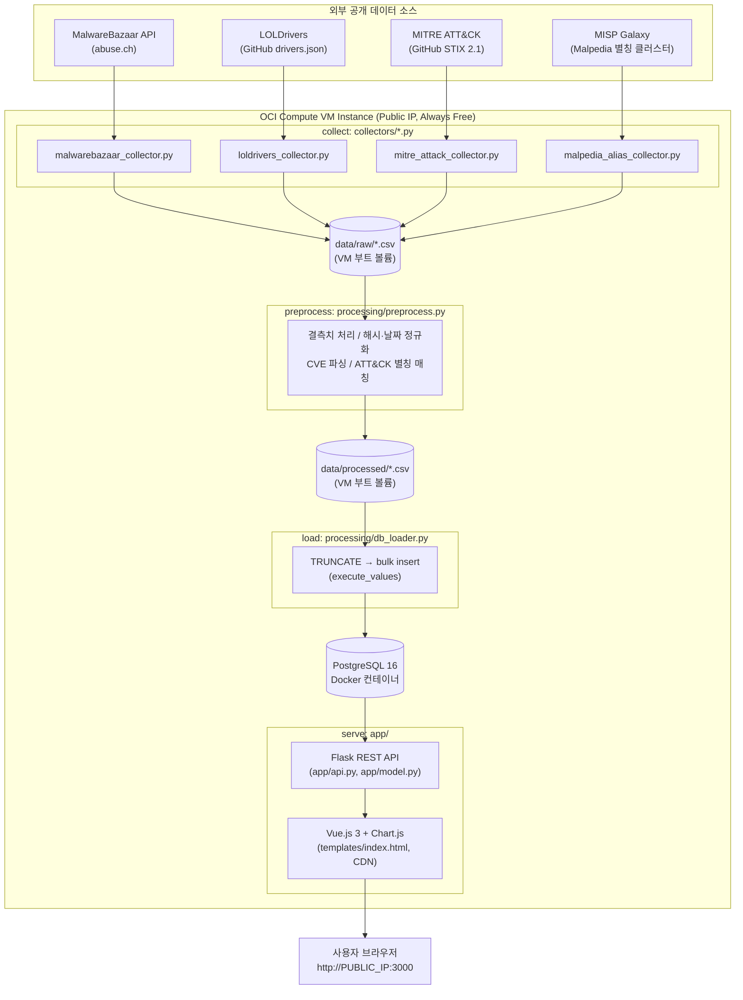

# 정적 IoC 기반 시각화 대시보드 및 공격체인 분석 웹서비스

OCI(Oracle Cloud Infrastructure) 위에서 동작하는 Cloud 데이터 파이프라인 구축 과제 산출물입니다.
공개 위협 인텔리전스 소스(MalwareBazaar, LOLDrivers, MITRE ATT&CK, MISP Galaxy)를 수집 →
정제 → MITRE ATT&CK TTP 매핑 → PostgreSQL 적재 → Flask REST API/Vue.js 대시보드로 제공하는
전체 파이프라인을 구현합니다. 설계 배경과 데이터 처리 방법론의 상세 근거는 [`docs/project.pdf`](docs/project.pdf)
(중간 보고서)를 따릅니다.

## 1. 서비스 소개 및 사용 시나리오

### 왜 필요한가
SOC(보안관제) 분석가나 CTI 담당자는 악성코드 해시, 서명, 취약 드라이버, ATT&CK 기법 정보를
MalwareBazaar·LOLDrivers·MITRE ATT&CK 등 서로 다른 사이트를 오가며 수동으로 대조하는 경우가
많습니다. 이 프로젝트는 이 정적 IoC 데이터를 한 곳에 모아 정제하고, 악성코드 패밀리를
MITRE ATT&CK의 Technique·Tactic과 자동으로 연결해 "이 위협이 어떤 공격 기법과 관련되는가"를
빠르게 파악할 수 있는 대시보드를 제공합니다.

### 사용 시나리오
1. **탐지 동향 파악**: 메인 대시보드에서 최근 가장 많이 관측된 악성코드 패밀리/YARA 룰, 시계열
   추이, 파일 유형 분포를 확인한다.
2. **샘플 조사**: 특정 해시나 패밀리명을 검색해 메타데이터(파일 정보, YARA 매칭 근거, 서명 여부,
   Triage 행위 태그)와 해당 샘플이 매핑된 ATT&CK 기법을 함께 조회한다.
3. **공격 기법 관점 분석**: ATT&CK 매핑 탭에서 Tactic × Technique 히트맵과 매핑률을 보고, 어떤
   공격 기법이 수집 데이터 안에서 실제로 관측되는지 확인한다.
4. **위협 그룹 단위 분석**: 그룹(APT29, Lazarus 등)을 선택하면 MITRE가 공식 문서화한 전체
   attack chain을 kill-chain 순서로 보여주고, 그중 우리가 실제로 수집한 샘플로 뒷받침되는
   technique을 별도로 표시한다.

### 프로젝트 범위 (project.pdf 1-1)
정적으로 공개된 IoC(해시, 파일 메타데이터, YARA 매칭 결과, 취약 드라이버, CVE)를 대상으로 하며,
실시간 스트림 탐지나 행위 기반(IoA) 분석, 인증/권한 관리 같은 프로덕션 하드닝 기능은 범위에
포함하지 않습니다.

## 2. 아키텍처 설명

### 2-1. 전체 Workflow



> 수집(collect) → 저장(store, 1차 CSV) → 가공(process) → 적재(store, DB) → 제공(serve)의 5단계가
> 모두 하나의 OCI Compute VM 인스턴스 안에서 실행됩니다. `python run_pipeline.py {collect|
> preprocess|load|all}` 로 각 단계를 개별/전체 실행할 수 있습니다 (자세한 흐름은 4장 참고).

### 2-2. 사용한 OCI 리소스 목록

| 리소스 | 사양/설정 | 용도 |
|---|---|---|
| Compute VM Instance | `VM.Standard.E2.1.Micro` (Always Free), Ubuntu | Docker(PostgreSQL 16) + Flask 앱을 함께 구동하는 단일 서버 |
| VCN Security List / NSG | Ingress `TCP 3000` 허용 (SSH `22`는 기본 설정 유지) | 웹서비스(Flask, `FLASK_PORT=3000`)를 외부에 공개 |
| VM 내부 방화벽 (ufw/iptables) | `3000` 포트 허용 | Security List 통과 후 OS 레벨에서도 포트 개방 |
| Boot Volume (기본 제공) | VM 인스턴스 기본 볼륨 | `data/raw/`, `data/processed/` CSV와 Docker PostgreSQL 데이터 파일을 동일 볼륨에 저장 |

> **현재 구성의 제약**: Block Volume을 별도로 붙이거나 Object Storage에 원본(raw) 데이터를
> 백업/보관하는 구조는 아직 도입하지 않았고, 모든 데이터가 VM의 기본 Boot Volume 위에서
> Docker 컨테이너로 함께 운용됩니다. 배경과 개선 계획은 6장(한계점 및 향후 개선 방향)에
> 정리했습니다.

### 2-3. 컴포넌트 구성

- **수집(collect)**: `collectors/*.py` — 소스 1개당 스크립트 1개, `if __name__ == "__main__"`으로
  단독 실행 가능. 외부 API 호출 실패는 개별적으로 흡수하고 계속 진행한다.
- **가공(process)**: `processing/preprocess.py` — 정규화 헬퍼를 한 곳에 모으고, 결측치/해시/날짜/
  CVE/ATT&CK 매핑 키를 일괄 정제한다.
- **적재(load)**: `processing/schema.sql` + `processing/db_loader.py` — PostgreSQL에 full-refresh
  방식(`TRUNCATE ... RESTART IDENTITY CASCADE` 후 벌크 insert)으로 적재한다.
- **제공(serve)**: `app/service.py`(외부 API 클라이언트) → `app/model.py`(DB 조회/집계) →
  `app/api.py`(Flask 라우트) → `app/app.py`(앱 팩토리) 계층 분리. 프론트엔드는 빌드 스텝 없이
  Vue 3 Options API + Chart.js를 CDN으로 로드한다 (`templates/index.html`, `static/js/app.js`).

## 3. 설치 및 실행 방법

### 3-1. 로컬 개발 환경

```bash
python -m venv venv
source venv/Scripts/activate   # Windows Git Bash
pip install -r requirements.txt
```

`.env` 파일에 MalwareBazaar API 키(https://bazaar.abuse.ch/account/ 에서 발급)와 DB 접속 정보를
입력합니다 (`docker-compose.yml` 기본값과 이미 맞춰져 있음).

```bash
# DB 실행 (Docker)
docker compose up -d

# 파이프라인 실행
python run_pipeline.py collect     # MalwareBazaar/LOLDrivers/MITRE ATT&CK/MISP Galaxy 원본 수집
python run_pipeline.py preprocess  # 정제 (결측치, 해시 정규화, CVE 파싱, ATT&CK 키 매칭 등)
python run_pipeline.py load        # PostgreSQL 적재 (매 실행마다 전체 갱신)
# 또는 한 번에: python run_pipeline.py all

# 웹서비스 실행
python -m app.app   # 기본 포트 5000 (FLASK_PORT로 변경 가능)
```

브라우저에서 http://localhost:5000 접속 (랜딩 페이지 `/`, 대시보드는 `/dashboard`).

MITRE ATT&CK STIX 번들은 `data/raw/enterprise-attack.json`에 캐시되어, 두 번째 실행부터는
재다운로드하지 않습니다.

#### 파이프라인 자동 실행 (`app/scheduler.py`)

`python -m app.app`로 웹서비스를 띄우면, 별도 cron/systemd 등록 없이 Flask 프로세스 안
데몬 스레드가 매일 지정 시각(기본 03:00)에 `run_pipeline.py`의 collect→preprocess→load를
그대로 실행합니다. `.env`로 조정합니다.

```bash
PIPELINE_SCHEDULER_ENABLED=true   # false로 두면 자동 실행 비활성화
PIPELINE_SCHEDULE_HOUR=3
PIPELINE_SCHEDULE_MINUTE=0
```

한 번의 실행 중 일부 수집 소스가 실패해도(네트워크 오류 등) 예외를 흡수하고 다음 날 스케줄에
다시 시도합니다. 다만 스케줄이 Flask 프로세스 생존에 종속되므로, 실행 중이던 프로세스가
재시작되는 시점이 마침 03:00 언저리와 겹치면 그날 실행이 밀리거나 건너뛸 수 있습니다(6장 참고).

### 3-2. OCI VM 배포 환경

로컬과 동일한 코드를 OCI Compute VM에 SSH로 접속해 그대로 실행합니다.

```bash
git clone <repo-url> && cd project
python3 -m venv venv && source venv/bin/activate
pip install -r requirements.txt
docker compose up -d               # PostgreSQL 컨테이너 기동
python run_pipeline.py all         # 최초 1회 수동 실행 (수집 → 전처리 → 적재)
FLASK_PORT=3000 python -m app.app  # 3000번 포트로 기동
```

- 웹서비스 접속: `http://<PUBLIC_IP>:3000` (실제 IP는 제출 시 채워 넣습니다)
- OCI VCN Security List/NSG에서 `TCP 3000` Ingress를 허용하고, VM 내부 `ufw`/`iptables`에서도
  같은 포트를 열어야 외부에서 접속됩니다 (2-2절 참고).
- 최초 실행 이후의 재수집은 `app/scheduler.py`가 Flask 프로세스 안에서 자동으로 처리합니다
  (아래 "파이프라인 자동 실행" 참고). 별도 cron 등록 없이 웹서비스만 계속 띄워두면 됩니다.
- 프로세스를 SSH 세션 종료 후에도 유지하려면 `tmux`/`screen`/`systemd` 등 원하는 방식으로
  백그라운드 실행하면 됩니다 (이 저장소는 앱 실행 커맨드 자체만 정의하며 특정 프로세스
  매니저를 강제하지 않습니다).

## 4. 데이터 흐름 상세 설명

| 수집 소스 | 저장 위치(1차, raw) | 가공 로직 | 저장 위치(2차, DB) | 제공 방식 |
|---|---|---|---|---|
| MalwareBazaar API (`get_recent`, `get_taginfo`, `get_info`) | `data/raw/malwarebazaar_samples.csv` | `process_samples()` — 결측치(`signature` 없음 → `unclassified`), 해시 소문자 정규화, `first_seen`/`last_seen` ISO 8601 통일, `tags`/`yara_rule_names` 세미콜론 리스트를 `yara_matches`/`sample_behaviors`/`sample_references` 자식 테이블로 분리 | `samples`, `yara_matches`, `sample_behaviors`, `sample_references` (PostgreSQL) | `GET /api/dashboard/*`, `GET /api/sample/<hash>`, `GET /api/sample/search` |
| LOLDrivers GitHub (`drivers.json`) | `data/raw/loldrivers_samples.csv` | `process_drivers()` — CVE 정규식(`CVE-\d{4}-\d+`) 파싱, `vulnerable`/`malicious` 카테고리 구분 유지 | `vulnerable_drivers` | `GET /api/drivers/category` |
| MITRE ATT&CK STIX (`enterprise-attack.json`) | `data/raw/attack_software_technique.csv`, `attack_group_technique.csv` | `process_attack_mapping()` — `signature`를 ATT&CK `malware/tool` 명칭·별칭과 대조(대소문자 통일 + Malpedia 별칭 클러스터 확장), Group(intrusion-set)의 `uses` 관계를 kill-chain 순서로 재구성 | `attack_ttp_mapping`, `attack_group_technique` | `GET /api/attack/*` |
| MISP Galaxy (`clusters/malpedia.json`) | `data/raw/malpedia_aliases.csv` | `build_alias_clusters()` — 패밀리명 동치 클래스 구성 (ATT&CK 매핑 전처리 단계에서만 사용, 별도 DB 테이블 없음) | — | ATT&CK 매핑 정확도 보강용 (5장 참고) |
| 태그 ↔ MITRE Group 대응 | (전처리 중 생성) | `_resolve_group_for_tag()` — MalwareBazaar 수집용 APT 태그(`Lazarus`, `APT29` 등)를 MITRE Group 정식명/별칭과 매칭 | `group_tag_resolution` | `GET /api/attack/groups`, `GET /api/attack/group/<local_tag>` |

파이프라인은 배치(batch) 방식이며, `python run_pipeline.py all`을 웹서비스(`app/scheduler.py`)가
매일 자동으로 재실행합니다(3-2절 "파이프라인 자동 실행" 참고). 데이터베이스 적재는 매 실행마다
관련 테이블을 `TRUNCATE ... RESTART IDENTITY CASCADE` 후 전량 재적재하는 full-refresh 방식입니다.

### 그룹별 Attack Chain (APT Group 단위 분석)

기존 매핑(signature → software → technique)은 "어떤 technique이 전체적으로 많이 쓰였는가"만
보여줄 뿐, 특정 위협 행위자의 공격 흐름은 알 수 없었습니다. 이를 위해 MITRE STIX의
`intrusion-set`(Group) 객체와 그 `uses` 관계(Group→Technique 직접, Group→Software→Technique
간접)를 `collectors/mitre_attack_collector.py`에서 추가로 추출해 `attack_group_technique`
테이블에 저장합니다.

MalwareBazaar 수집에 사용한 APT 태그(`Lazarus`, `APT29`, `Kimsuky` 등 10개,
`collectors/malwarebazaar_collector.py`의 `APT_TAGS`)는 `processing/preprocess.py`의
`_resolve_group_for_tag()`가 MITRE Group 정식명/별칭과 대조해 매핑합니다
(예: `OceanLotus` → `APT32`, `APT34` → `OilRig`).

ATT&CK 매핑 탭에서 그룹을 선택하면(`GET /api/attack/group/<local_tag>`):
- MITRE가 공식 문서화한 해당 그룹의 전체 attack chain을 kill chain 순서
  (reconnaissance → ... → impact)대로 보여주고,
- 그중 어떤 technique이 **우리가 실제로 수집한 해당 그룹 태그 샘플**로도 뒷받침되는지
  (`observed_locally`) 별도로 구분합니다.

즉 "MITRE 문서상의 이론적 attack chain"과 "우리 정적 IoC 데이터로 검증 가능한 부분"을 한 화면에서
대조해서 볼 수 있습니다.

참고로 이 STIX 데이터에서 MITRE가 기존 `defense-evasion` 단일 tactic을 `stealth`와
`defense-impairment`로 세분화한 것을 확인했습니다 — `app/model.py`의 `KILL_CHAIN_ORDER`가 이를
반영해 정렬합니다.

### ATT&CK 매칭 보강 (Malpedia 별칭 크로스워크)

MITRE ATT&CK의 `x_mitre_aliases`는 구조화된 별칭이 부실합니다 (예: Emotet에 흔히 쓰이는 별칭
`Heodo`, `Geodo` 중 `Geodo`만 등록되어 있고 `Heodo`는 누락). 이를 보완하기 위해
[MISP Galaxy](https://github.com/MISP/misp-galaxy)가 배포하는 Malpedia 클러스터
(`clusters/malpedia.json`, 3,683개 패밀리·synonyms 포함)를 별도 수집원으로 추가했습니다.

`processing/preprocess.py`의 `build_alias_clusters()`가 이 데이터를 정규화된 이름 기준 동치
클래스(같은 패밀리로 취급되는 이름 집합)로 구성하고, `process_attack_mapping()`은 signature를
ATT&CK와 직접 매칭하기 전에 먼저 이 클러스터로 확장한 후보 이름들로도 매칭을 시도합니다.
예: `Heodo` → (Malpedia 클러스터) → `{Emotet, Geodo, Heodo}` → `Geodo`가 ATT&CK 룩업에 있으므로
매칭 성공.

실제 매핑률(총 signature 중 ATT&CK 매핑에 성공한 비율)은 수집 시점마다 달라질 수 있어 하드코딩된
수치 대신 대시보드 Footer와 `GET /api/attack/mapping-rate`에서 실시간으로 확인할 수 있도록
했습니다.

## 5. 서비스 페이지 구성

| 페이지 | 주요 구성 요소 | API |
|---|---|---|
| 랜딩 페이지 (`/`) | 서비스 소개, 수집 통계 요약, 대시보드/샘플 검색 진입 버튼 (`templates/landing.html`, Vue 없이 정적 렌더링) | `/api/meta` |
| 대시보드 앱 (`/dashboard`) | 메인 대시보드/샘플 상세 조회/ATT&CK 매핑 탭을 가진 Vue SPA (`templates/index.html`) | 아래 항목 전체 |
| ㄴ 메인 대시보드 | Top N 패밀리/YARA 룰, 시계열 추이, 파일 유형 분포, 드라이버 카테고리 분포 | `/api/dashboard/*`, `/api/drivers/category` |
| ㄴ 샘플 상세 조회 | 해시/패밀리명/파일명 검색 → 메타데이터, YARA 매칭 근거, ATT&CK 매핑, AI 분석 | `/api/sample/search`, `/api/sample/<hash>`, `/api/sample/<hash>/analyze` |
| ㄴ ATT&CK 매핑 탭 | 매핑률, Top N Technique, Tactic × Technique 히트맵, 그룹별 Attack Chain | `/api/attack/*` |
| ㄴ Footer(공통) | 총 수집 건수, 수집 기간, 출처 | `/api/meta` |

## 6. 한계점 및 향후 개선 방향

### 한계점

- **정적 데이터 기반**: 본 프로젝트는 정적으로 공개된 메타데이터에 의존하므로, 실시간 위협 탐지나
  행위 기반 분석은 범위에 포함되지 않습니다 (project.pdf 6장과 동일).
- **인프라 단일화**: 현재는 OCI Compute VM 인스턴스 1대의 Boot Volume 위에서 Docker(PostgreSQL)와
  Flask 앱이 함께 동작합니다. Block Volume/Object Storage를 저장소 특성(정형/비정형, 백업 등)에
  맞게 분리하지 않아, VM 장애 시 원본(raw) 데이터와 DB 데이터가 함께 유실될 위험이 있습니다.
- **프로세스 종속적인 스케줄링**: `run_pipeline.py all`의 매일 자동 실행은 `app/scheduler.py`가
  Flask 프로세스 안 데몬 스레드로 처리합니다(OS의 cron이나 OCI Resource Scheduler에 별도 등록하지
  않음). 따라서 웹서비스 프로세스가 떠 있어야만 스케줄이 유지되며, 프로세스가 예정 시각 전후로
  재시작되면 그날 실행이 밀리거나 건너뛸 수 있습니다.
- **접근 경로**: 웹서비스는 VM Public IP:3000으로 직접 노출되어 있으며, 도메인/HTTPS/리버스
  프록시는 아직 구성하지 않았습니다.
- **YARA 매칭 의존성**: 자체 YARA 엔진을 구동하지 않고 MalwareBazaar API 응답에 포함된
  `yara_rules` 필드(커뮤니티 사전 검증 결과)를 그대로 신뢰하므로, 정확도는 MalwareBazaar
  커뮤니티의 검증 수준에 좌우됩니다.
- **ATT&CK 매핑 한계**: `signature`와 ATT&CK STIX의 malware/tool 공식 명칭·별칭 간 표기 차이,
  그리고 ATT&CK가 문서화하지 않은 커머디티 악성코드 패밀리의 존재로 인해 실제 연관성이 있음에도
  매칭되지 않는 사례가 발생할 수 있습니다. 사전 검증 결과 유명 패밀리 위주 표본에서는 매핑률이
  60% 이상으로 나타났으나, 무작위 수집 데이터에서는 이보다 낮을 수 있습니다.
- **API 목록 조회 응답의 한계**: MalwareBazaar `get_recent`/`get_taginfo` 목록 응답에는
  `yara_rules`가 없어, signature가 있는 샘플 중 일부(`yara_enrich_limit`, 기본 300건)만
  `get_info`로 개별 보강합니다.

### 향후 개선 방향

- **저장소 분리**: `data/raw/` 원본 CSV를 OCI Object Storage 버킷에 백업/버저닝하고, PostgreSQL
  데이터 디렉터리를 별도 Block Volume으로 분리해 VM과 데이터의 생명주기를 독립시킵니다.
- **배치 자동화 이중화**: 현재의 프로세스 내장 스케줄러(`app/scheduler.py`) 외에, VM의 cron 또는
  OCI Resource Scheduler에도 `run_pipeline.py all`을 등록해 Flask 프로세스 재시작 시점과 무관하게
  스케줄이 유지되도록 이중화합니다.
- **접근성/보안 강화**: Nginx 리버스 프록시 + 도메인 + HTTPS(Let's Encrypt)를 도입해 IP:포트
  직접 노출을 없애고, 관리 목적의 API에는 최소한의 인증을 추가합니다.
- **DB 이중화 검토**: 현재 PostgreSQL 단일 컨테이너 구성을 OCI가 제공하는 관리형 MySQL(HeatWave)
  등으로 전환해 백업/장애 복구 전략을 마련합니다.

## 7. 오픈소스 및 데이터 출처

- [MalwareBazaar Community API](https://bazaar.abuse.ch/api/) — abuse.ch, 악성코드 해시/메타데이터/YARA 매칭 결과
- [LOLDrivers](https://www.loldrivers.io/) — 취약/악성 드라이버 목록, 관련 CVE
- [MITRE ATT&CK STIX Data](https://github.com/mitre-attack/attack-stix-data) — Technique/Tactic/Group 지식 베이스
- [MISP Galaxy (Malpedia cluster)](https://github.com/MISP/misp-galaxy) — 악성코드 패밀리 별칭 크로스워크
- 프론트엔드 CDN 라이브러리: [Vue.js 3](https://vuejs.org/), [Chart.js](https://www.chartjs.org/), [Bootstrap 5](https://getbootstrap.com/)

참고문헌(설계 근거)은 [`docs/project.pdf`](docs/project.pdf) 말미의 참고문헌 목록을 따릅니다.
